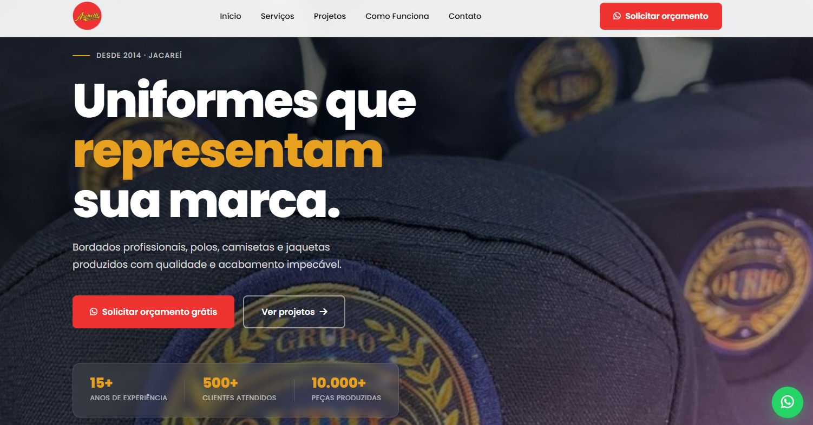

# 🧵 Archetti Bordados

Website desenvolvido para a Archetti Bordados com o objetivo de apresentar seus serviços, destacar trabalhos realizados e facilitar o contato com clientes por meio de uma interface moderna, responsiva e intuitiva.

## ✨ Funcionalidades

* Página inicial com banner em destaque
* Seção "Sobre" apresentando a empresa
* Apresentação dos serviços oferecidos
* Galeria de fotos e vídeos dos trabalhos realizados
* Botão de contato via WhatsApp
* Rodapé com informações de contato
* Layout responsivo para diferentes dispositivos
* Animações e efeitos visuais suaves

## 🛠️ Tecnologias Utilizadas

* HTML5
* CSS3
* JavaScript
* Visual Studio Code

## 🎯 Objetivo do Projeto

O projeto foi desenvolvido com o objetivo de fortalecer a presença digital da Archetti Bordados, proporcionando uma plataforma para apresentar seus serviços, demonstrar a qualidade dos trabalhos realizados e facilitar o contato com clientes.

Além disso, o desenvolvimento permitiu aplicar e consolidar conhecimentos em desenvolvimento front-end, responsividade e boas práticas de estruturação de interfaces web.

## 👩‍💻 Desenvolvimento

Desenvolvido por **Michely Archetti**.
